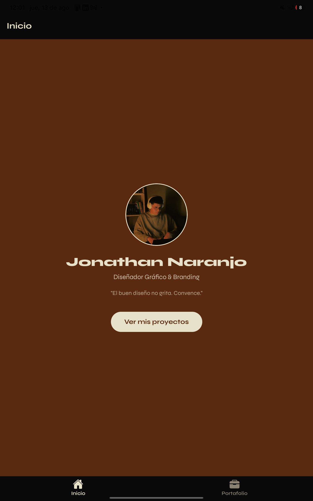
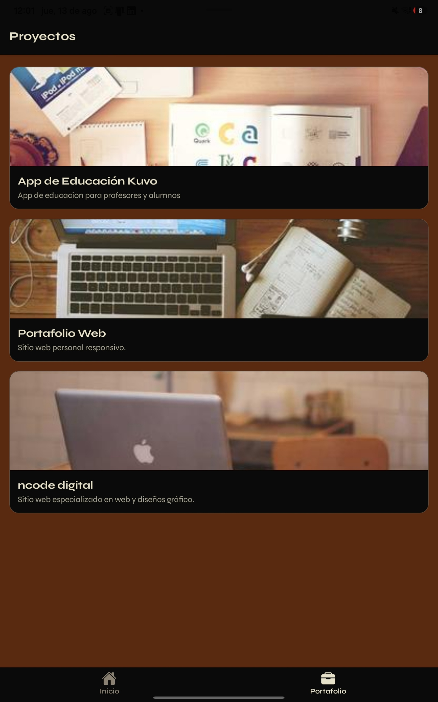
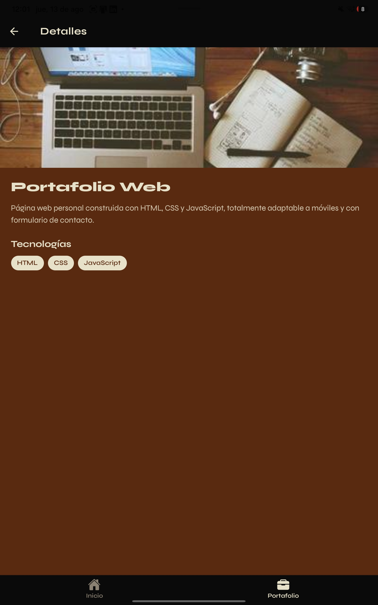

# Portafolio Profesional — App Móvil

Aplicación móvil de portafolio profesional desarrollada con **React Native** y **Expo**.
Presenta un perfil, un listado de proyectos y una vista de detalle de cada uno,
con la identidad visual de mi sitio web [De Naranjo](https://denaranjo.com).

## Características

- Pantalla de **Inicio** con perfil, foto y acceso al portafolio.
- Pantalla de **Proyectos** con lista desplazable (`FlatList`) de tarjetas.
- Pantalla de **Detalles** con información ampliada de cada proyecto.
- Navegación combinando **Tabs** (pestañas) y **Stack** (pila) con React Navigation.
- Diseño en modo oscuro con paleta y tipografía (Syne) de marca.

## Tecnologías

- React Native + Expo (SDK 54)
- React Navigation (Bottom Tabs + Native Stack)
- Hooks de React (useState / useFonts)
- Tipografía Syne (@expo-google-fonts)

## Estructura del proyecto

/data → projects.js (datos simulados)
/components → ProjectCard.js (tarjeta reutilizable)
/screens → HomeScreen, ProjectsScreen, DetailsScreen
App.js → configuración de navegación y tema

## Cómo ejecutarlo

1. Clonar el repositorio:
```bash
   git clone https://github.com/jonathannaranjo600-eng/Proyecto1movil.git
   cd Proyecto1_jonathan_naranjo
```
2. Instalar dependencias:
```bash
   npm install
```
3. Iniciar el proyecto:
```bash
   npx expo start
```
4. Escanear el código QR con la app **Expo Go**.

## Capturas






## Autor

Jonathan Naranjo Mendoza — Proyecto para el curso de Desarrollo de Dispositivos Móviles.